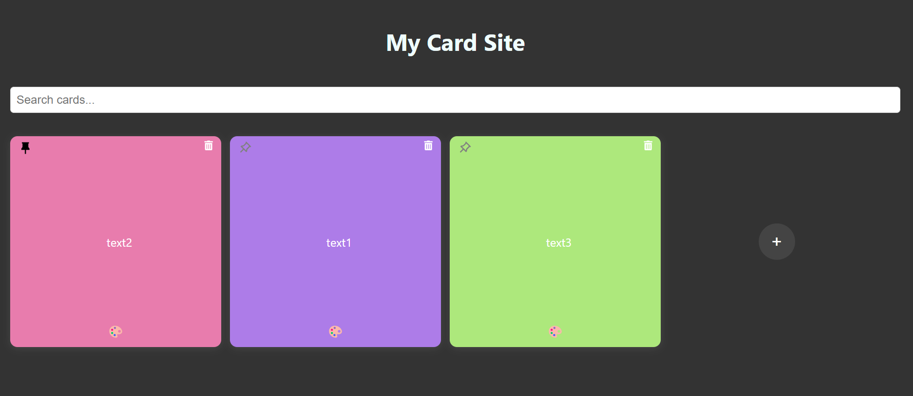
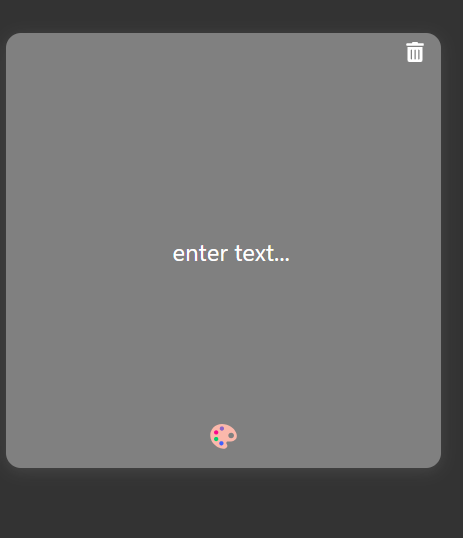
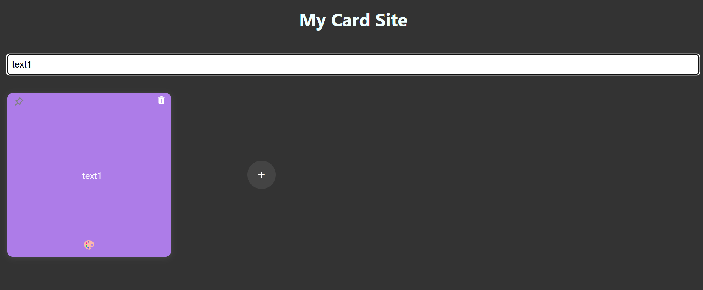
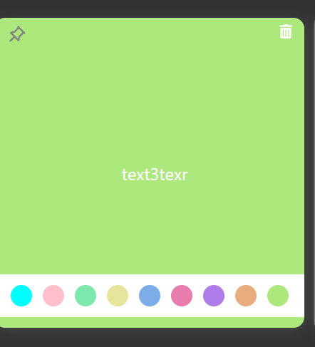

# Card Application front

This project is a React application that connects to a Node.js server, providing a user-friendly interface for managing cards. Users can create, update, delete, and pin cards. Pinned cards are stored in localStorage for persistence.

## Installation

1. **Clone the repository:**

```bash
   git clone <https://github.com/onico100/card-site-server>
```

2. **Install dependencys:**

```bash
   cd <card-client>
   npm install
```

3. **Usage:**
   Run the Server:

   - Clone and set up the server from the repository here.
   - Follow the server's setup instructions.
   - Start the server on the desired port.

4. **Run the Client Application:**
   npm start

## Features

- Create Cards: Add new cards with default text and no background color.
- Update Cards: Edit the card content and select from nine background colors .
- Delete Cards: Remove cards from the list.
- Pin/Unpin Cards: Pin cards to the top of the list for easy access. Pinned cards are saved in localStorage.
- Search: Filter cards by their content.

## Folder Structure

card-front/
├── public/ #static files
│ ├── images/ #screenshots
├── src/
│ ├── components/ # React components like Card and CardContainer
│ ├── services/ # API functions in service.js
│ ├── App.js # Main app component
│ └── index.js # Entry point
└── package.json # Project metadata and dependencies

## Technologies Used

- **React**: For building the user interface.
- **React Icons:** For using icons in the application.
- **Axios (or Fetch API):** For making HTTP requests to the backend server.

## API Service

The service.js file contains functions to interact with the Node.js server API using Axios. Here are the main functions:

- getAllCards: Fetches all cards from the server.
- getCardById: Fetches a single card by its ID.
- createCard: Creates a new card with specified text and background color.
- updateCard: Updates an existing card by its ID with new data.
- deleteCard: Deletes a card by its ID.

## App Screenshots

### Home Screen



### add card



### search filter screen



## choose color screen



## Troubleshooting

- Server Connection Issues: Ensure the server is running on the correct port.
- LocalStorage Issues: If pinned cards aren’t persisting, check your browser’s localStorage settings.
